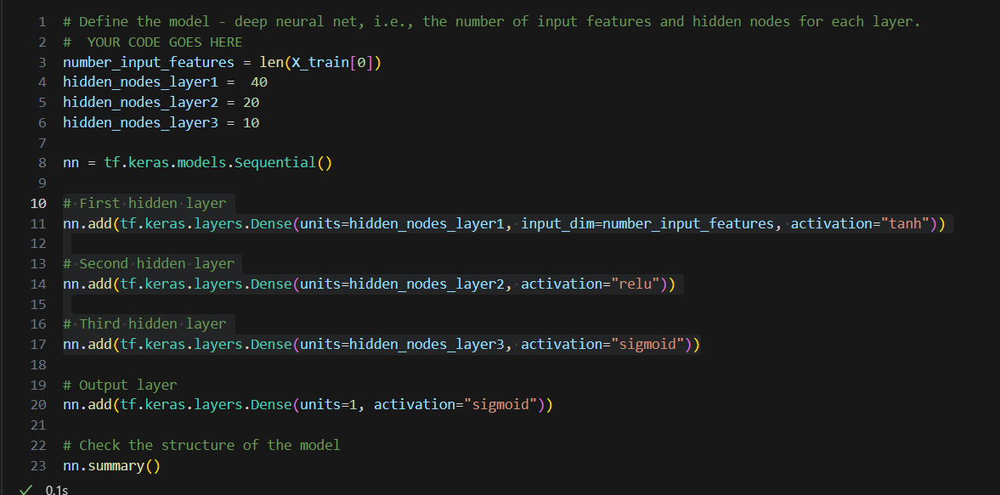
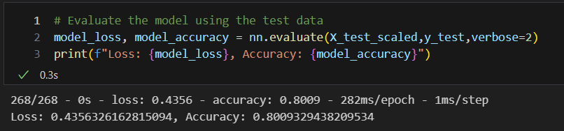

# deep-learning-challenge

### REPORT

### Data Preprocessing

Purpose of doing this machine learning:
  * The purpose of this project is to help a machine learning model predict what company is likely to be a good fit for funding based on other companies recieving funding. It can help predict if an application will be successful or not with a funding request.

What variable(s) are the target(s) for your model?
  * "IS_SUCCESSFUL" is the target variable in this model.

What variable(s) are the features for your model?
The final model features are:
  * NAME, APPLICATION_TYPE, AFFILIATION, CLASSIFICATION, USE_CASE, ORGANIZATION, INCOME_AMT, ASK_AMT.

What variable(s) should be removed from the input data because they are neither targets nor features?
  * EIN - ID number
  * STATUS - Not really helpful as one column had 34272 No vs 27 Yes values. Does not seem balanced.
  * SPECIAL_CONSIDERATIONS - 34294 (1) vs 5 (0) values. Does not seem balanced.

### Compiling, Training, and Evaluating the Model

How many neurons, layers, and activation functions did you select for your neural network model, and why?
  * I used 3 layers for the model. 

* I used three different layers each with a different model to help the computer find a better fit.

Were you able to achieve the target model performance?

* I was able to get to 80% using this model.

What steps did you take in your attempts to increase model performance?

* I removed SPECIAL_CONSIDERATIONS and STATUS as they seemed like Edge/Outliers as they had very low values.
* I added a 3rd layer for more computation power to help solve the model better.
* I used 3 different activation functions for more solving power. They all seemed to work well with the data.
* I changed fields like "CLASSIFICATION" and "APPLICATION_TYPE" down to 1000 and binned anything under 1000 into a Other field.
* I made sure the learning rate was not too high not too low at 0.001.
* I lastly put the "NAME" back into the model as I thought that it had significance to who gets funded and who does not. Perhaps it is the naming or because a company shows up multiple time and has reach or some other factor. But we let the machine learning decide this. In the second optimization I added back the names of the clients and binned any that were below 2 in terms of frequency. This could create some sort of Bias but it might also help find some sort of patern in the giving/granting of items. This might be a wanted or unwanted criteria for a government or philanthropist to include previous recipients in this model. It did increase the result past 75% to 80.09%. There might be Bias here for the model but its also how some governments/banks/charity funders operate in the first place. 

Summary: Summarize the overall results of the deep learning model. Include a recommendation for how a different model could solve this classification problem, and then explain your recommendation.

  * We could use the KERAS tuning library from Excercise 2-4 to get a optimized fit for this model. This might help get a better score on the model. I did not attempt to optimize it this way but I think it could help.

#### Instructions
Step 1: Preprocess the Data
Using your knowledge of Pandas and scikit-learn’s StandardScaler(), you’ll need to preprocess the dataset. This step prepares you for Step 2, where you'll compile, train, and evaluate the neural network model.

Start by uploading the starter file to Google Colab, then using the information we provided in the Challenge files, follow the instructions to complete the preprocessing steps.

Read in the charity_data.csv to a Pandas DataFrame, and be sure to identify the following in your dataset:
What variable(s) are the target(s) for your model?
What variable(s) are the feature(s) for your model?
Drop the EIN and NAME columns.

Determine the number of unique values for each column.

For columns that have more than 10 unique values, determine the number of data points for each unique value.

Use the number of data points for each unique value to pick a cutoff point to bin "rare" categorical variables together in a new value, Other, and then check if the binning was successful.

Use pd.get_dummies() to encode categorical variables.

Split the preprocessed data into a features array, X, and a target array, y. Use these arrays and the train_test_split function to split the data into training and testing datasets.

Scale the training and testing features datasets by creating a StandardScaler instance, fitting it to the training data, then using the transform function.

Step 2: Compile, Train, and Evaluate the Model
Using your knowledge of TensorFlow, you’ll design a neural network, or deep learning model, to create a binary classification model that can predict if an Alphabet Soup-funded organization will be successful based on the features in the dataset. You’ll need to think about how many inputs there are before determining the number of neurons and layers in your model. Once you’ve completed that step, you’ll compile, train, and evaluate your binary classification model to calculate the model’s loss and accuracy.

Continue using the file in Google Colab in which you performed the preprocessing steps from Step 1.

Create a neural network model by assigning the number of input features and nodes for each layer using TensorFlow and Keras.

Create the first hidden layer and choose an appropriate activation function.

If necessary, add a second hidden layer with an appropriate activation function.

Create an output layer with an appropriate activation function.

Check the structure of the model.

Compile and train the model.

Create a callback that saves the model's weights every five epochs.

Evaluate the model using the test data to determine the loss and accuracy.

Save and export your results to an HDF5 file. Name the file AlphabetSoupCharity.h5.

Step 3: Optimize the Model
Using your knowledge of TensorFlow, optimize your model to achieve a target predictive accuracy higher than 75%.

Use any or all of the following methods to optimize your model:

Adjust the input data to ensure that no variables or outliers are causing confusion in the model, such as:
Dropping more or fewer columns.
Creating more bins for rare occurrences in columns.
Increasing or decreasing the number of values for each bin.
Add more neurons to a hidden layer.
Add more hidden layers.
Use different activation functions for the hidden layers.
Add or reduce the number of epochs to the training regimen.
Note: If you make at least three attempts at optimizing your model, you will not lose points if your model does not achieve target performance.

Create a new Google Colab file and name it AlphabetSoupCharity_Optimization.ipynb.

Import your dependencies and read in the charity_data.csv to a Pandas DataFrame.

Preprocess the dataset as you did in Step 1. Be sure to adjust for any modifications that came out of optimizing the model.

Design a neural network model, and be sure to adjust for modifications that will optimize the model to achieve higher than 75% accuracy.

Save and export your results to an HDF5 file. Name the file AlphabetSoupCharity_Optimization.h5.

Step 4: Write a Report on the Neural Network Model
For this part of the assignment, you’ll write a report on the performance of the deep learning model you created for Alphabet Soup.

The report should contain the following:

Overview of the analysis: Explain the purpose of this analysis.

Results: Using bulleted lists and images to support your answers, address the following questions:

Data Preprocessing

What variable(s) are the target(s) for your model?
What variable(s) are the features for your model?
What variable(s) should be removed from the input data because they are neither targets nor features?
Compiling, Training, and Evaluating the Model

How many neurons, layers, and activation functions did you select for your neural network model, and why?
Were you able to achieve the target model performance?
What steps did you take in your attempts to increase model performance?
Summary: Summarize the overall results of the deep learning model. Include a recommendation for how a different model could solve this classification problem, and then explain your recommendation.
Step 5: Copy Files Into Your Repository
Now that you're finished with your analysis in Google Colab, you need to get your files into your repository for final submission.

Download your Colab notebooks to your computer.

Move them into your Deep Learning Challenge directory in your local repository.

Push the added files to GitHub.

Requirements

Preprocess the Data (30 points)
Create a dataframe containing the charity_data.csv data , and identify the target and feature variables in the dataset (2 points)
Drop the EIN and NAME columns (2 points)
Determine the number of unique values in each column (2 points)
For columns with more than 10 unique values, determine the number of data points for each unique value (4 points)
Create a new value called Other that contains rare categorical variables (5 points)
Create a feature array, X, and a target array, y by using the preprocessed data (5 points)
Split the preprocessed data into training and testing datasets (5 points)
Scale the data by using a StandardScaler that has been fitted to the training data (5 points)

Compile, Train and Evaluate the Model (20 points)
Create a neural network model with a defined number of input features and nodes for each layer (4 points)
Create hidden layers and an output layer with appropriate activation functions (4 points)
Check the structure of the model (2 points)
Compile and train the model (4 points)
Evaluate the model using the test data to determine the loss and accuracy (4 points)
Export your results to an HDF5 file named AlphabetSoupCharity.h5 (2 points)
Optimize the Model (20 points)
Repeat the preprocessing steps in a new Jupyter notebook (4 points)
Create a new neural network model, implementing at least 3 model optimization methods (15 points)
Save and export your results to an HDF5 file named AlphabetSoupCharity_Optimization.h5 (1 point)

Write a Report on the Neural Network Model (30 points)
Write an analysis that includes a title and multiple sections, labeled with headers and subheaders (4 points)
Format images in the report so that they display correction (2)
Explain the purpose of the analysis (4)
Answer all 6 questions in the results section (10)
Summarize the overall results of your model (4)
Describe how you could use a different model to solve the same problem, and explain why you would use that model (6)